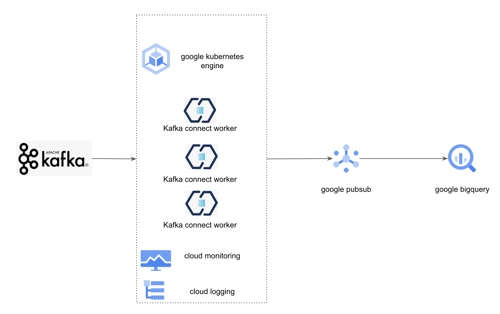

# Connect Kafka to Bigquery using Kafka connect pubsub connector quick start guide
This guide give the simple steps for ingesting kafka message using Kafka connect pubsub connector. By using this guide, customer who is using kafka as message broker can quickly connect kafka data source to Bigquey.

* [Introduction](#introduction)
* [Architecture](#architecture)

* [How-To](#how-to)
    * [Create GKE Cluster](#create-gke-cluster)
    * [Build Kafka connect image with pubsub connector](#build-kafka-connect-image-with-pubsub-connector)
    * [Prepare pubsub topic/subscription](#prepare-pubsub-topicsubscription)
    * [Deploy Kafka connect resource](#deploy-kafka-connect-resource)
    * [Deploy Kafka connect connector resource](#deploy-kafka-connect-connector-resource)
    * [Logging](#logging)
    * [Metric](#metric)
    * [Pricing](#pricing)

## Introduction
This guide give a deployment sample using [Strimzi Kafka Operator](https://strimzi.io/), which deploy and configure Apache Kafka Connect Cluster on Kubernetes. Google provide 1st party [kafka connect sink connector](https://github.com/googleapis/java-pubsub-group-kafka-connector) , which provide the capability to consume kafka topic messages to google cloud pubsub, cloud pubsub give the out-of-box bigquery subscribe capbility to ingest message data to Bigquery. For customers that has Kafka message broker installbase, this guide will be a fast start to bridge kafka and bigquery together, then build on real-time warehouse base on kafka messages.

## Architecture

## How-To
### Before you begin
1. make sure you have an available GCP project for your deployment
2. Enable the required service API using [cloud shell](https://cloud.google.com/shell/docs/run-gcloud-commands)
```
gcloud services enable compute.googleapis.com artifactregistry.googleapis.com container.googleapis.com cloudbuild.googleapis.com clouddeploy.googleapis.com storage.googleapis.com
```
### Create GKE Cluster
```
PROJECT_ID=<replace this with your project id>
GKE_CLUSTER_NAME=<replace this with your GKE cluster name>
REGION=<replace this with your region>

gcloud beta container --project $PROJECT_ID clusters create $GKE_CLUSTER_NAME --zone "${REGION}-c" --no-enable-basic-auth --cluster-version "1.24.8-gke.2000" --release-channel "regular" --machine-type "e2-medium" --image-type "COS_CONTAINERD" --disk-type "pd-balanced" --disk-size "100" --metadata disable-legacy-endpoints=true --scopes "https://www.googleapis.com/auth/cloud-platform" --max-pods-per-node "110" --num-nodes "1" --logging=SYSTEM,WORKLOAD --monitoring=SYSTEM --enable-ip-alias --network "projects/${PROJECT_ID}/global/networks/default" --subnetwork "projects/${PROJECT_ID}/regions/${REGION}/subnetworks/default" --no-enable-intra-node-visibility --default-max-pods-per-node "110" --no-enable-master-authorized-networks --addons HorizontalPodAutoscaling,HttpLoadBalancing,GcePersistentDiskCsiDriver --enable-autoupgrade --enable-autorepair --max-surge-upgrade 1 --max-unavailable-upgrade 0 --enable-managed-prometheus --enable-shielded-nodes --node-locations "us-central1-c"
```

### Install Strimzi Kafka Operator
Get GKE cluster access
```
gcloud container clusters get-credentials $GKE_CLUSTER_NAME --region $REGION
```
Create Kafka resource namespace
```
kubectl create namespace <namespace-name>
```
Install Strimizi Kafka Operator
Refer Strimzi Install Guide(https://strimzi.io/docs/operators/in-development/deploying.html#deploying-cluster-operator-str), change the namespace to the namespace you created before.

### Build Kafka connect image with pubsub connector
Download the latest kafka-pubsub-connector jar, then place the jar file into the connector-build/plugins/ folder path.

Build image locally
```
# run in connector-build folder
docker build -t kafkaconnect .
```

Tag image and push to google container registry
```
docker tag kafkaconnect gcr.io/${PROJECT_ID}/kafka/kafkaconnect

docker push gcr.io/${PROJECT_ID}/kafka/kafkaconnect
```

### Deploy Kafka connect resource
Edit the kubernetes/kafka-connect.yaml, change the value with <>.
```
kubectl apply -f kubernetes/kafka-connect.yaml -n <namespace-name>
```
### Prepare pubsub topic/subscription
Refer pubsub [docs](https://cloud.google.com/pubsub/docs/bigquery) to create the topic/subscription.

### Deploy Kafka connect connector resource
Edit the kubernetes/kafka-connector-task-config.yaml, change the value with <>.
```
kubectl apply -f kubernetes/kafka-connector-task-config.yaml -n <namespace-name>
```

### Logging
By default, the GKE cluster has enabled the workload logging, all the logs from kafka connect pods will be ingest into Cloud Logging. To change this config please refer the [GKE Logging Guide](https://cloud.google.com/stackdriver/docs/solutions/gke/managing-logs#system_only_logs) 
### Metric
By default, all the metrics from kafka connect resource is exposed by google managed prometheus. The GKE cluster is created with Managed prometheus collector, apply the podmonitoring resource to scrapt the metrics endpoints.
```
kubectl apply -f kubernetes/kafka-connect-prometheus.yaml -n <namespace-name>
```
For the availabled metrics list, please reference [metrics docs](https://docs.confluent.io/kafka-connectors/self-managed/monitoring.html#using-jmx-to-monitor-kconnect).

For query the metrics, please refer the [query docs](https://cloud.google.com/stackdriver/docs/managed-prometheus/query)
### Pricing
The solution leverage GCP GKE, PUBSUB service, please refer the pricing docs to get the detailed pricing information.

[GKE Pricing Docs](https://cloud.google.com/kubernetes-engine/pricing)

[PUBSUB Pricing Docs](https://cloud.google.com/pubsub/pricing#pubsub)
